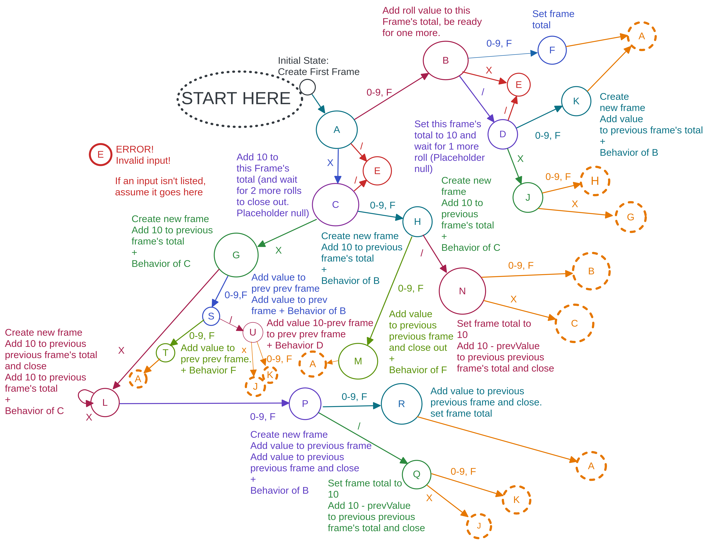

# WeInfuse-Bowling

## Tragic Assumptions
1. Each element of rolls is a throw, irrespective of what frame the player is on.
2. Input is an array that looks like this: [4, 5, X, 3, /, 0]
3. Acceptable Non-Integer values:
   * X - Strike, worth 10 + the values of the next two throws
   * / - Spare, brings the frame total to 10 + the next throw
4. Input array will not include MORE than the appropriate number of rolls (otherwise, the result would be a nested array of up-to-10-elements arrays, instead of just the single up-to-10-elements array)
5. Incomplete frames (such as a single integer roll, or a strike with no follow-up rolls) return as null until the required roll to finish out that frame's score are added to the array.

## Approach
1. Though there are many ways to solve this prompt, I think writing a quick
state-machine to parse the incoming rolls sounds like the most fun!  Here's
a quick diagram:

2. Alright.  TLDR That state diagram ended up being a lot more complicated than I thought it would be.  Looking at it now, anyone coming in to maintain or change the code (read as: a ginormous switch statement that would be completely-inscrutable-without-said-diagram) would likely not bother and just write the whole thing over from scratch.

3. Here's my new, iterative approach:
    * Loop through the input array
    * Use protected methods to *try* to look ahead to future rolls to calculate strikes and spares
    * Profit

# Installation
1. clone down the repo from git
2. open a terminal window and navigate to the project directory
3. `npm install`
4. after it's done installing, run `npm start` to run the jest tests
5. profit

## Future work
If I get extra time today, I might bake this into an Express server.